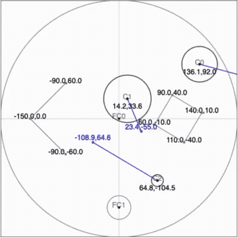

# circle-collision-without-vector
A circle (2D ball) elastic collision physics code demo with the following features : 
- Handle circle collision detection and response **WITHOUT vectors, Math.sqrt and trigonometry functions like Math.sin and Math.cos**, just use + , - , * and / .
- Plain JavaScript without other frameworks or libraires (ie : just VanillaJS).
- All codes are enclosed in a single .html file, which may download and run in browsers directly.

The demo has non-debug (index.html) and debug (index-debug.html) versions.

# Live demo
- index.html : https://shuffleandko.github.io/circle-collision-without-vector/index.html
- index-debug.html : https://shuffleandko.github.io/circle-collision-without-vector/index-debug.html

# Preview
| index.html  | index-debug.html |
| ------------- | ------------- |
|   |   |

---

# Supported objects
The demo supports the following objects:
- Circles
- Fixed circles
- Line segments / Fixed polygons (share the same definition)

## Circles:


Circle rigid body that can move freely on the canvas.

Define it in `circleArray`, eg:
```
const circleArray = [
    {
      cx:80,
      cy:80,
      r:30,
      m:Math.PI*30*30, //mass = area
      vx:90,
      vy:30
    }
];
```
Codes that handle collision detection and response:
```
for(let i = 0; i < circleArray.length ; i++){
  const c1 = circleArray[i];
  for(let j = i; j < circleArray.length ; j++){
    const c2 = circleArray[j];
    const dx=c2.cx-c1.cx;
    const dy=c2.cy-c1.cy;
    if(dx * dx + dy * dy <= (c1.r + c2.r)*(c1.r + c2.r)){ //find if d is smaller than (or equals to) r1+r2
      const rel_c2vx = c2.vx - c1.vx;
      const rel_c2vy = c2.vy - c1.vy;
      if(rel_c2vx * dx + rel_c2vy * dy < 0){ //apply collision only when 2 circles are colliding instead of separating
        c1.vx += 2 * dx * c2.m * (rel_c2vx * dx + rel_c2vy * dy) / (dx * dx + dy * dy) / (c1.m + c2.m);
        c1.vy += 2 * dy * c2.m * (rel_c2vx * dx + rel_c2vy * dy) / (dx * dx + dy * dy) / (c1.m + c2.m);
        c2.vx -= 2 * dx * c1.m * (rel_c2vx * dx + rel_c2vy * dy) / (dx * dx + dy * dy) / (c1.m + c2.m);
        c2.vy -= 2 * dy * c1.m * (rel_c2vx * dx + rel_c2vy * dy) / (dx * dx + dy * dy) / (c1.m + c2.m);
      }
    }
  }
}
```

---

## Fixed circles:


Don't move at all, circles would rebound when collide with them. It supports both external and internal collisions at the same time.

Define it in `fixedCircleArray`, eg:
```
const fixedCircleArray = [
    {
      cx:0,
      cy:-150,
      r:20
    }
];
```
Codes that handle collision detection and response:
```
for(const fc of fixedCircleArray){
  for(const c2 of circleArray){
    const dx=c2.cx-fc.cx;
    const dy=c2.cy-fc.cy;
    const vxFactor = c2.vx * dx + c2.vy * dy;
    if( (dx * dx + dy * dy >= fc.r * fc.r && dx * dx + dy * dy <= (fc.r + c2.r)*(fc.r + c2.r) && vxFactor < 0) || (dx * dx + dy * dy <= fc.r * fc.r && dx * dx + dy * dy >= (fc.r - c2.r)*(fc.r - c2.r) && vxFactor > 0)){ //apply collision only if 2 circles touch and the direction of speed is correct
      c2.vx -= 2 * dx * vxFactor / (dx * dx + dy * dy);
      c2.vy -= 2 * dy * vxFactor / (dx * dx + dy * dy);
    }
  }
}
```
---

## Line segments / Fixed polygons:

| Line segments  | Fixed polygons |
| ------------- | ------------- |
|   |   |

Line segments and fixed polygons share the same definition in this engine. They are static objects that can block circles the same way as fixed circles. When setting `isClosed` as `true`, it would connect the start and the end of the segments and become a fixed polygon.

Define it in `fixedPolygonArray`, eg:

Line segments:
```
const fixedPolygonArray = [
    {
      x:[-90,-150,-90],
      y:[60,0,-60],
      isClosed:false
    }
];
```

Fixed polygons:
```
const fixedPolygonArray = [
    {
      x:[140,90,60,110],
      y:[10,40,-10,-40],
      isClosed:true
    }
];
```
Codes that handle collision detection and response (Both line segments and fixed polygons share the same code):
```
for(const fp of fixedPolygonArray){
  //fixed point and circle check collision
  for(let i=0;i < fp.x.length;i++){
    for(const c2 of circleArray){
      const dx=c2.cx-fp.x[i];
      const dy=c2.cy-fp.y[i];
      const vxFactor = c2.vx * dx + c2.vy * dy;
      if( dx * dx + dy * dy <= c2.r * c2.r && vxFactor < 0){ //apply collision only if 2 circles touch and the direction of speed is correct
        c2.vx -= 2 * dx * vxFactor / (dx * dx + dy * dy);
        c2.vy -= 2 * dy * vxFactor / (dx * dx + dy * dy);
      }
    }
  }
  //line segment and circle collision
  for(let i = 0 , j = 1 ; fp.isClosed ? i < fp.x.length : i < fp.x.length - 1 ; i++ , j = (i+1) % fp.x.length){
    const lx = fp.x[j] - fp.x[i];
    const ly = fp.y[j] - fp.y[i];
    for(const c2 of circleArray){
      if((c2.cx - fp.x[i]) * lx > -(c2.cy - fp.y[i]) * ly && (c2.cx - fp.x[j]) * lx < -(c2.cy - fp.y[j]) * ly){
        const cxx1 = (c2.cx - fp.x[i]) * ly - (c2.cy - fp.y[i]) * lx;
        if(cxx1 * cxx1 <= c2.r * c2.r * (lx * lx + ly * ly)){ //check if the circle touches the line segment
          const relVx = c2.vx * ly - c2.vy * lx;
          if((cxx1 > 0 && relVx < 0) || (0 > cxx1 && relVx > 0)){ //check if the circle is approaching to the line segment
            c2.vx -= 2 * ly * relVx / (ly * ly + lx * lx);
            c2.vy += 2 * lx * relVx / (ly * ly + lx * lx);
          }
        }
      }
    }
  }
}
```
