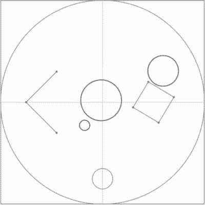

# circle-collision-without-vector
A circle (2D ball) elastic collision physics code demo with the following features : 
- Handle circle collision detection and response **WITHOUT vectors, Math.sqrt and trigonometry functions like Math.sin and Math.cos**, just use + , - , * and / .
- Plain JavaScript without other frameworks or libraires (ie : just VanillaJS).
- All codes are enclosed in a single .html file, which may download and run in browsers directly.

The demo has non-debug (index.html) and debug (index-debug.html) versions:

| index.html  | index-debug.html |
| ------------- | ------------- |
|   |   |

---

# Supported objects
The demo supports the following objects:

## Circles:


Circle rigid body that can move freely on the canvas.

Define it in `circleArray`, eg:
```
const circleArray = [
    {
      cx:80,
      cy:80,
      r:30,
      m:Math.PI*30*30, //mass = area
      vx:90,
      vy:30
    }
];
```

---

## Fixed circles:


Don't move at all, circles would rebound when collide with them. It supports both external and internal collisions at the same time.

Define it in `fixedCircleArray`, eg:
```
const fixedCircleArray = [
    {
      cx:0,
      cy:-150,
      r:20
    }
];
```

---

## Line segments / Fixed polygons:

| Line segments  | Fixed polygons |
| ------------- | ------------- |
|   |   |

Line segments and fixed polygons share the same definition in this engine. They are static objects that can block circles the same way as fixed circles. When setting `isClosed` as `true`, it would connect the start and the end of the segments and become a fixed polygon.

Define it in `fixedPolygonArray`, eg:

Line segments:
```
const fixedPolygonArray = [
    {
      x:[-90,-150,-90],
      y:[60,0,-60],
      isClosed:false
    }
];
```

Fixed polygons:
```
const fixedPolygonArray = [
    {
      x:[140,90,60,110],
      y:[10,40,-10,-40],
      isClosed:true
    }
];
```
